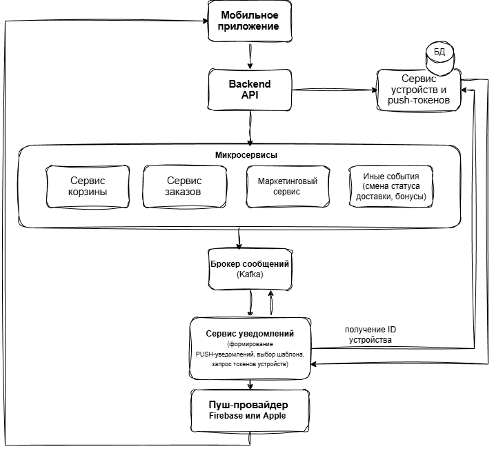

# Задание 3: архитектура

### 1) Микросервисы. Типы уведомлений от микросервисов backend:
- Долгое отсутствие действий в корзине
- Отмена заказа
- Рекламные рассылки
- Иные события
- Хранилище ID устройств

### 2) Брокер сообщений. 
Каждый сервис при наступлении события публикует сообщение в брокер сообщений. (Kafka, RabbitMQ)

### 3) Сервис уведомлений. 
Подписан на брокера сообщений. (Занимается только подготов-кой и отправкой уведомлений). Для этого он использует Ключи устройств (ID), которые назначаются каждому мобильному устройству при установке приложения и отправляет его на бэкенд 

### 4) Сервис уведомлений. 
Сервис уведомлений отправляет HTTP-запрос к соответствующему провайдеру Firebase или Apple а они уже передают на соответствующее устройство Push уведомле-ние.

Подробно описано на схеме

## Архитектурная схема PUSH-уведомлений

